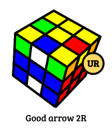

<meta charset="UTF-8">
<meta name="viewport" content="width=device-width, initial-scale=1">
<link rel="stylesheet" href="https://fonts.googleapis.com/css?family=Oswald">
<link rel="stylesheet" href="https://fonts.googleapis.com/css?family=Bree Serif">
<link rel="stylesheet" href="https://fonts.googleapis.com/css?family=Open Sans">

# Intuitive EOLR with two misoriented edges

---

A comprehensive guide by Pedro Ilídio.

## 1. Introduction

With a naturally lower move count, Roux has been considered a prominent alternative to the mainstream CFOP method for speedsolving. But for this potential to be fully explored and optimal
times to be achieved with Roux, one of the essentialities is to employ
optimizations of the last six edges (LSE) step, such as EOLR, increasing the move efficiency as much as possible but avoiding an expressive recognition burden.

However, despite Roux being advertised as an intuitive solving method, the
learning of EOLR still usually involves memorizing and recognizing a
bunch of specific cases and sequences of moves, even if parts of these
sequences are commonly regarded as intuitive.

In this document, I present some ideas to improve EOLR intuitiveness
that I have been experimenting with for a few months. Specifically, a
general algorithm is proposed to obtain a "good arrow" from any of the
LSE states with only two misoriented edges (2mo). Since a 2mo or 4mo
state appears in 15 out of 16 times (93.75% probability), having
intuitive solutions to these two states is of great relevance to one's performance. Although
finding a good arrow from 4mo in general is already pretty intuitive,
new ideas for tackling 2mo are appreciated.

I do not expect the present procedure to be a replacement for the
current recognition methods of experienced solvers, but I do hope to:

1.  Facilitate EOLR learning for newer Roux users, that still have
    limited to none experience with EOLR;
2.  Promote development of new LSE recognition techniques, proposing a
    framework of thought to be expanded by the community. Hopefully a
    humble step towards fully intuitive one-look LSE.

No EOLR knowledge is needed, but we require the reader to be familiar
with Rubik\'s cube notation and the Roux method.

A throughout introduction to basic concepts of edge orientation in
Roux's last six edges (LSE) step is firstly presented in Section 2,
aimed at describing the process of thought that originated these ideas
and building the conceptual foundation for the final proposed algorithm,
summarized at the end (Section TL;DR). An introduction to EOLR is then
provided (Section 3), contextualizing EOLR in the framework
described in the first setions followed by several case examples with
links to 3D visualizations (Example solves appendix) and a final discussion of current
limitations of the technique and open paths for future thoughts (Section 5).

Cube illustrations were rendered with
[PuzzleGen](https://github.com/tdecker91/puzzle-gen)
(rotations: {x:63, y:40, z:39},
strokeWidth: 0.04).

## 2. Edge orientation principles

Consider the much more simple setting of six light bulbs that can be
either turned on or turned off. They start all turned off, and your goal
is to light them all up. However, you are required to do so by an
arbitrary number of steps in which, for each step, you select four lamps
and toggle their switch, so that those which are turned on become turned
off and vice-versa. The solution one would probably come up with is
pretty straightforward: just turn 4 of the lights on, then select 3
lights on and 1 off to toggle, after which you end up with 4 lights off
that you can just turn on in one last step (Figure 1).

{style="max-width: 600"}

**Figure 1:** Simple light bulb analogy to LSE.

The LSE-4a step of the Roux method is not that different from that
simple analogy. In this step, each of the six edges can be either
oriented or misoriented.

>**Definition:** We say an edge is **oriented** if its U or D sticker (here represented as white or yellow, as many cubers choose it to be) faces up or down when the U or the D center is placed up or down (Figure 2).

{style="max-width: 200"}
{style="max-width: 200"}
{style="max-width: 200"}
{style="max-width: 200"}
{style="max-width: 200"}
{style="max-width: 200"}

**Figure 2:** Examples of LSE states with labels indicating the oriented (o) and misoriented (mo) edges.

**Whenever a U turn is made around an F or B center (green or blue in the
diagrams), the four edge pieces surrounding it switch orientation**, so
that oriented edges become misoriented and vice-versa (Figure 3). Since there are 6
edges remaining and we can only toggle orientation of four edges at a
time, there can only be 2, 4 or 6 misoriented edges in total.

{style="max-width: 500"}

**Figure 3:** Illustration of edge orientation toggling. When a U or U' move is made with an F or B center
on top, the four edges around it flip their orientatons, so that the
oriented edges become misoriented and the misoriented become oriented.

So the way we solve the orientation of the LSE necessarily involves a
last stage where 4 remaining misoriented edges are oriented by a U or U'
move around a B or F center (similarly to the light bulbs analogy).

Notice that two consecutive turns (a U2 move) cancel each other out,
having no effect in edge orientation.

The possible adjustments of the edges' positions that do not change
    their orientation:
1.  U or U' can be arbitrarily performed if a white or yellow center is
    on top.
2.  One can arbitrarily raise a red/orange center and do U2.

Since we usually recognize cases with white or yellow on top, it is
useful to, in one of these states, consider beforehand the set of pieces
that would be around the F or B centers if F or B is placed in the top
layer. For the F center, this group of edges corresponds to the edges
in the positions UF, UL, UR and DF. I will thereafter refer to this set
of pieces as the **F-cycle** (Figure 4).

Analogously, I will call by **B-cycle** the edges at UB, UL, UR and DB
collectively. Again, these cycles correspond to the pieces that will end
up on top around the F center when an M' move is performed (in the case
of the F-cycle), or around the B center when an M move is executed (for
the B-cycle). When the respective center (F or B) is on top, performing
a U or U' move will switch the orientation of the 4 edges of the
corresponding cycle, besides shifting their position as shown in Figure
4.

>**Definition:** We collectively call by **F-cycle** the edge positions UF, UR, DF and UL, and by **B-cycle** the edge positions UB, UL, DB and UR.

{style="max-width: 300"}

**Figure 4:** F-cycle representation. If M\'UM is performed, \"turning the F-cycle
clockwise\", the four highlighted edges will toggle orientation and be
permuted as indicated by the arrows.

Therefore, the cycles correspond, in the simpler light bulb analogy, to
the two possible sets of 4 lights that we can toggle together, and the
last step of edge orientation also involves selecting 4 lamps off
(misoriented edges) to turn on, corresponding to the usually called
"arrow" configuration, where all edges of a cycle and only them are
misoriented.

A difference here is that edges can be repositioned with arbitrary U
moves around a white/yellow (U/D) center or U2 around  an F/B center,
without changing their orientation.

>**Definition:** I refer to performing M' followed by U or U' and then M or M' as **turning the F-cycle**, and to making an M move followed by U or U' and then by M or M' as **turning the B-cycle**.

These optional turning directions will later be restricted by EOLR.

So the procedure to orient all LSE using only M and U moves (footprint:
usual EOLR algorithms may involve R or r moves in the 4mo state, not
considered here.) is strikingly similar to Figure 1. Starting from a
state where all 6 edges are misoriented (what I will call the **6mo
state**), follow Procedure 1.

**Procedure 1: orienting all the last six edges from the 6mo state.**

---

 

1.  **Switch 4mo edges.**
    a.  Turn the F- or B-cycle in any way. 2 misoriented edges remain (I
    will call it the 2mo state).
2.  **Switch 3o + 1mo edges.**
    a.  Adjust the U face so to set the F-cycle or B-cycle to be composed of
        3 oriented and 1 misoriented edge.
    b.  Turn the cycle set in the last substep, switching orientation of the
        edges in the cycle. 4 misoriented edges remain (4mo state).
3.  **Switch 4mo edges.**
    a.  Set the 4 remaining misoriented edges in a single cycle, by only
        turning the U face around the white-yellow (UB) centers or making U2
        around a red-orange (FB) center, so that the edge orientation is
        kept.
    b.  Turn the cycle composed of the 4 misoriented edges, orienting them.

Notice how the cycle-setting followed by cycle-turning substeps closely
resembles the light bulb selection followed by light toggling in the
previous simple analogy.

If there are only 2 or 4 misoriented edges in your cube, not 6, you may
just skip to step 2 or step 3 above, respectively, but *the order of the
steps is definite*. One can demonstrate that the states in the
shortest route to edge orientation (or all lights on) have the
imperative order 6mo ⟶ 2mo ⟶ 4mo ⟶ 0mo by
enumerating the few possible state transitions (Figure 5).

{style="max-width=500px"}

**Figure 5:** State transition graph of edge orientation states for LSE.
"mo" stands for misoriented edge, and "o" means oriented edge. Arrow
labels indicate the composition of the selected group of edges to flip.
For example, 3o + 1mo means to select 3 oriented and 1 misoriented edge
and toggle their orientation. The shortest route to the goal 0mo state
is highlighted in purple. These are the only relevant transitions,
corresponding to the steps described in Procedure
1.

### 2.1. Arrow case lookahead from 2mo

A relevant property to be noticed is that, after step 2.a, the two
remaining edges outside the set up cycle will necessarily be one
oriented and one misoriented. Pay attention for a moment to two specific
pieces: the single misoriented edge in the cycle you selected (which
will become oriented after turning the cycle) and the remaining oriented
edge outside the selected cycle. **These will be the 2 remaining oriented
edges outside the last cycle, formed in step 3.a.** Notice that after step
3.a they will necessarily be separated by a blue or green (F/B)
center. By recognizing these two edges early on and predicting their
final position after 3.a, one can lookahead all the steps following 2.a.

To facilitate the explanation, I will refer to these edges in the
following sections as the *in-cycle misoriented (ICM)* edge and the
*out-cycle oriented (OCO)* edge. Remember that ICM and OCO in the 2mo
state will become the only oriented edges in the 4mo (arrow) state.

>**Definition:** The only misoriented edge in the cycle selected in step 2.a of procedure 1 will be here called **in-cycle misoriented (ICM)**. The only oriented edge outside this cycle will be called **out-cycle oriented (OCO)**.

Another thought I find useful in this process of looking ahead in step 2
is that ICM and OCO need to end up one in the U face and the other in
the D face, i.e. one must ensure they are not left in the same U or D
face.

1.  ICM and OCO will end up one in the U face and the other in the D
    face.
2.  ICM and OCO will also end up both in the same F or B face, separated
    by an F/B center.

## 3. EOLR principles

Although the Algorithm 1 to orient the LSE is inescapable, there is some degree of freedom in its steps
that can be exploited to skip or simplify the Roux's 4b step. This
freedom manifests itself in two ways:

1.  There are usually multiple ways of performing the 2.a and 3.a and
    steps, i.e. one can set several cycles that satisfy the edge
    composition condition of the steps.
2.  In the cycle turning steps, are arbitrary both
    a.  the direction (U or U') in which we choose to turn a cycle after
        raising its corresponding center to the U face and
    b.  the final choice of an M or M' move to bring back a white or yellow
    center to the top.

The EOLR technique, first proposed by James Straugham (Athefre) and further developed by Iuri Grangeiro, Kian Mansour and Louis de Mendonça (see the [original post](https://www.speedsolving.com/threads/roux-misoriented-centers-table.38176/#post-772850) and [Speedsolving wiki](https://www.speedsolving.com/wiki/index.php/Roux_method)
), consists of utilizing this freedom in order to place, during the edge orientation
step (Roux's 4a), the UR-UL or UF-UB pairs of edges in the DF and DB
positions, where they can easily be inserted to their correct spots in
the U layer, essentially combining Roux's 4a and 4b in a single step,
i.e. doing 4b while solving 4a.

>**Definition:** Let's generically call the original UR-UL or UF-UB edge pairs by **matching edge pairs** from here on.

Thus, the goal of EOLR can be stated as placing a matching edge pair in
the DF-DB positions while solving LSE orientation.

**Note:** No distinction is made between UR-UL or UF-UB pairs, so that
using the UFUB approach in Roux\'s 4b is naturally covered.

If we reverse engineer the solved state, with all edges oriented and a
matching pair at DF-DB, we arrive at only 5 possible edge pair
configurations in the 4mo state that allow for easy insertion at DF-DB
while still solving orientation. And remember that, since 4mo with a
cycle with only misoriented edges (an \"arrow\") is the mandatory last
step for edge orientation, reaching one of these "good arrows" is mandatory to solve EOLR.

{style="max-width: 200"}
{style="max-width: 200"}
{style="max-width: 200"}
{style="max-width: 200"}
{style="max-width: 200"}

**Figure 6** The 5 "good arrows" possible. The symmetric equivalents obtained by
flipping B and F are not represented, but are just a y2 move apart from
the examples. The original UR and UL (red-yellow and orange-yellow in
the figures) are highlighted. In the 2R and 2L cases, the UL edge is at
the DB position. Among the original UR and UL, which edge is UR and which is UL is not important in the figure, their positions could be swapped without compromising the diagram's meaning.

**Good arrow 1L** -
**Set up:** U M2 U2 M U\' M -
**Solution:** M\' U  M\'
([3D view](
https://cubedb.net/?puzzle=3&title=Good_arrow_1A&scramble=U_M2_U2_M_U-\_M&alg=M-\_U_M-
))

**Good arrow 1R** -
**Set up:** U\' M\' U2 M2 U\' M -
**Solution:** M\' U\'  M\'
([3D view](
https://cubedb.net/?puzzle=3&title=Good_arrow_1B&scramble=\_U-\_M-\_U2_M-\_M-\_U-\_M&alg=M-\_U-\_M-
))

**Good arrow 2L** -
**Set up:** U M U2 M2 U\' M -
**Solution:** M\' U\'  M
([3D view](
https://cubedb.net/?puzzle=3&title=Good_arrow_2A&scramble=U_M_U2_M2_U-\_M%0A&alg=M-\_U-\_M
))

**Good arrow 2R** -
**Set up:** M2 U M\' U M U2 M2 U2 -
**Solution:** M\' U  M
([3D view](
https://cubedb.net/?puzzle=3&title=Good_arrow_2B&scramble=M2_U_M-\_U_M_U2_M2_U2\_&alg=M-\_U_M
))

**Good arrow 3** -
**Set up:** M U\' M2 U2 M\' -
**Solution:** M U2 M2
([3D view](
https://cubedb.net/?puzzle=3&title=Good_arrow_3&scramble=\_\_M_U-\_M2_U2_M-&alg=M_U2_M2
))

Reverse engineering one step further, from the 2mo state (step 2 of
Procedure 1), the goal thus becomes achieving not only a 4mo state but a
good 4mo, i.e. a *good arrow*. And there lies the main objective here:
searching for an intuitive procedure to solve EOLR from 2mo, with no
need for memorization of any specific cases and their corresponding move
sequences.

## 4. EOLR with 2 misoriented edges

From the 5 good arrow cases (Figure 6) we will concentrate only on the
four first. In all the first four, notice how we always have one of the
two oriented edges pairing with a misoriented one. The two oriented
edges can be predicted from the 2mo state as described in section [Arrow
case lookahead]().

So, besides the in-cycle misoriented (ICM) and the out-cycle oriented
(OCO) edges described in the section, for EOLR, we also want to look for
a third edge that matches up with one of them, so that this third edge
and the ICM or this third edge and the OCO are either the original UL-UR or the original UF-UB edges.

At this point, the following statement can be made:

>**Conjecture:** if there is a third edge pairing up with either ICM or OCO and if it is adjacent to the ICM in the cycle set up in the 2a step of Procedure 1, there necessarily is a rotation of this cycle that leads to a good arrow.

Given its importance, I will call this third edge, being the match-up
with ICM or OCO, misoriented, in-cycle and adjacent to the ICM, by **MICA**.
By "adjacent" in this context, I mean that, if the cycle is raised to
the U face, this edge will not form a straight line with the ICM and the
raised center, forming an "L-shaped", 90º angle instead. This
is equivalent to saying that the MICA and the ICM must be connected by
one of the arrows illustrated in Figure 4.

>**Definition:** We call **adjacent** positions in the F-cycle the position pairs UL-UF, UF-UR, UR-DF and DF-UL. The adjacent positions in the B-cycle are UR-UB, UB-UL, UL-DB and DB-UR.

>**Definition:** In the 2mo state, an edge that matches either the ICM or the OCO, is misoriented, in-cycle, and adjacent to the ICM is called **MICA**.

>**Definition:** An F/B cycle in the 2mo state that satisfies the already stated
conditions of:
>
>1.  Being composed of 3 oriented edges and only one misoriented edge
    (the ICM);
>2.  Having a MICA.

is therefore called a **good cycle** (see Figure 7).

{style="max-width: 300"}
{style="max-width: 300"}
{style="max-width: 300"}

**Figure 7:** Three examples of good cycles are illustrated, with edge colors indicated
besides labels and connectors indicating the MICA and its matching edge,
both of which will end up in the DF and DB positions after EOLR is
completed. The solutions to these and other examples are fully described
in the Example solves appendix.

**Set up:**

U M U M2 U2 M U2 M\' U M\' U (Example case 5, first above)

M U\' M U\' M U M2 U M (Example case 4, second above)

U\' M U\' M\' U\' M U M U\' M2 (Example case 6, third case above)

Finally, the rotation that turns this good cycle into a good arrow can
be performed as described by Procedure 2, which substitutes step 2 of
Procedure 1, specializing it.

**Procedure 2: converting the 2mo state to a good arrow.**

---

 

1.  **Set up a good cycle**;
2.  **Raise the selected good cycle** by performing M\' if it is the F-cycle
    or M if it is the B-cycle;
3.  Execute a single **U or U' move** in way that places either ICM or MICA
    (whichever is outside the M slice) diagonally opposite to the
    OCO (i.e. setting ICM and OCO, or MICA and OCO, to be separated by
    the cube\'s core);
4.  Do an **M or M' move** in a way that keeps ICM and OCO in different
    vertical layers (one in the U layer, the other in the D layer).

After solving the good arrow, the MICA and its matching edge should arive at DF-DB.

Several examples of application of this procedure are shown in the Example solves appendix, with the intention of clarifying any confusion that may arise.

## 5. Final remarks and future work

Although less frequent, especially if employing UFUB, there are cases
where no good cycle can be formed but a good arrow can still be obtained with
the simple rotation of a cycle. For instance, if the ICM matches the
out-cycle misoriented edge there will be no MICA-ICM pair (see the following example). However, they can still be paired up in a good arrow by performing M U M in the example below.

**Example:** 2mo EOLR unexplained case. - 
**Set up:** M U M U M\' U M U\' M \' U M U\' -
**Solve:** M U M
([3D view](
https://cubedb.net/?puzzle=3&title=2mo_EOLR_unexplained_case&scramble=MUMUM-UMU-M-UMU-&alg=MUM\_%2F%2F_Obtain_a_good_arrow%0AU\_\_%2F%2F_AUF%0AM-\_U-\_M\_\_%2F%2F_Solve_the_good_arrow
))

An intuitive explanation is still lacking for those cases, so expanding
or generalizing the proposed procedure should be possible.

Furthermore, the last \"good arrow\" case in Figure 6 is not sought by
the proposed procedure, further suggesting eventual extensions.

Additionally, this work is written mainly from a \"U/D center on top\"
(or "oriented centers") perspective, so considering what is commonly
called \"misoriented centers\" poses a new territory to be explored
under the proposed optics. With F/B on top, turning the F/B-cycles, which
now surround U and D centers, does not toggle their orientation, and the
new goal of 4a seems to be generating 4 misoriented edges and getting
them to the top in order to orient them with an U move. Employing moves
that do not change orientation (U2 and cycle rotations) seems especially
useful to bring edges to the top.

Regarding recognition time, learning each EOLR case separately should naturally
still be faster. However, the proposed framework could be used as a
starting point for this memorization process, with ICM, OCO and MICA
positions becoming progressively more attached to specific move
sequences in \"muscle memory\".

Finally, some arbitrariness is still present in the described steps to
the 2mo-4mo transition. Namely, there are often multiple good cycles
available to be formed, and the last move of the cycle rotation (M or
M\') can be arbitrarily chosen in the cases where ICM and OCO are the
diagonally opposite edges of step 2.

Future proposals could further restrict this freedom in order to go
beyond 4b, worrying about \"good 4c\" cases even before 4a. Therefore, I
hope the ideas on the present work can contribute with the understanding of the last six edges behaviour, and perhaps sparkle further contributions that could open the doors to one-look LSE.

## TL;DR - (EOLR) How to intuitively get a good arrow from 2 misoriented edges

### Definitions

---

 

-   Let the two sets of edge positions (UL, UF, UR, DF) and (UR, UB, UL,
    DB) be respectively called **F-cycle** and **B-cycle**.
-   Positions are called **adjacent** if they are consecutive in the above
    specified order. For instance, adjacent positions in the F-cycle are
    UL-UF, UF-UR, UR-DF and DF-UL.
-   The original UR and UL or UF and UB edge pairs are generically
    called **matching pairs**, i.e. If U is yellow, yellow-red matches
    yellow-orange and yellow-blue matches yellow-green.

 

### Procedure

---

 

1.  **Setting up:** keeping white or yellow on top, adjust the U face
    setting up an F- or B-cycle such that:
    a.  The cycle is composed of three oriented edges and a single
        misoriented one.
    b.  Adjacent to the in-cycle misoriented (ICM) edge, there must be an
        oriented edge that matches either the ICM or the out-cycle oriented
        edge (OCO). Call this edge MICA (matching in-cycle adjacent).
2.  **M or M'**: raise the cycle you set up, i.e. do an M' move if it was
    the F-cycle or an M move if it was the B-cycle.
3.  **U or U'**: place either the MICA or the ICM (whichever was outside
    the M slice) diagonally opposite to the OCO.
4.  **M or M'**: reposition the M slice to keep the ICM and OCO in different layers,
    one in U, the other in D.

Multiple valid cycles can sometimes be found in step 1, but also none,
in some rare and specific situations, even if EOLR can still be solved.
Thus, further ideas and improvements are appreciated.

## A. Example solves

### Case 1 ([3D view](https://cubedb.net/?puzzle=3&title=2mo_EOLR_case_1&scramble=M-\_U_M_U2_M2_U_M-\_U-\_M-\_U_M_U2_M-&alg=%2F%2F_Good_B%252Dcycle_selected%3A_ICM%3DUL_MICA%3DUB%2C_OCO%3DUF%3B_Matching_pair_is_MICA%252DOCO%0AM\_%2F%2F_Raise_the_B%252Dcycle%0AU\_%2F%2F_Place_ICM_diagonally_opposite_to_OCO%0AM-\_\_%2F%2F_Keep_ICM_and_OCO_in_different_layers%0AU2\_\_%2F%2F_Place_OCO_on_top_of_ICM%0AM-\_U-\_M-\_\_%2F%2F_Solve_the_good_arrow))

* **Set up:** M\' U M U2 M2 U M\' U\' M\' U M U2 M\'

Good B-cycle selected: ICM=UL MICA=UB, OCO=UF; Matching pair
is MICA-OCO

* **M**  -  Raise the B-cycle

* **U**  -  Place ICM diagonally opposite to OCO

* **M\'**  -  Keep ICM and OCO in different layers

* **U2**  -  Place OCO on top of ICM

* **M\' U\' M\'**  -  Solve the good arrow

### Case 2 ([3D view](https://cubedb.net/?puzzle=3&title=2mo_EOLR_case_2&scramble=U_M2_U2_M2_U2_M_U_M-\_U-\_M_U_M&alg=%2F%2F_Good_B%252Dcycle_selected%3A_ICM%3DDB%2C_MICA%3DUR%2C_OCO%3DUF%3B_Matching_pair_is_MICA%252DOCO%0AM\_%2F%2F_Raise_the_B%252Dcycle%0AU-\_%2F%2F_Place_MICA_diagonally_opposite_to_OCO%0AM\_\_%2F%2F_Keep_ICM_and_OCO_in_different_layers%0AU\_\_%2F%2F_Place_ICM_on_top_of_OCO%0AM-\_U-\_M\_\_%2F%2F_Solve_the_good_arrow))

* **Set up:** U M2 U2 M2 U2 M U M\' U\' M U M

Good B-cycle selected: ICM=DB, MICA=UR, OCO=UF; Matching pair
is MICA-OCO

* **M**  -  Raise the B-cycle

* **U\'**  -  Place MICA diagonally opposite to OCO

* **M**  -  Keep ICM and OCO in different layers

* **U**  -  Place ICM on top of OCO

* **M\' U\' M**  -  Solve the good arrow

### Case 3 ([3D view](https://cubedb.net/?puzzle=3&title=2mo_EOLR_case_3&scramble=M2_U2_M-\_U_M-\_U-\_M2_U2_M_U_M&alg=%2F%2F_Good_F%252Dcycle_selected%3A_ICM%3DUF%2C_MICA%3DUR%2C_OCO%3DDB%3B_Matching_pair_is_MICA%252DICM%0AM-\_%2F%2F_Raise_the_F%252Dcycle%0AU-\_%2F%2F_Place_MICA_diagonally_opposite_to_OCO%0AM\_\_%2F%2F_Keep_ICM_and_OCO_in_different_layers%0AU\_\_%2F%2F_Place_ICM_on_top_of_OCO%0AM-\_U_M\_\_%2F%2F_Solve_the_good_arrow\_%2528lucky_4c_skip!%2529))
* **Set up:** M2 U2 M\' U M\' U\' M2 U2 M U M

Good F-cycle selected: ICM=UF, MICA=UR, OCO=DB; Matching pair
is MICA-ICM

* **M\'**  -  Raise the F-cycle

* **U\'**  -  Place MICA diagonally opposite to OCO

* **M**  -  Keep ICM and OCO in different layers

* **U**  -  Place ICM on top of OCO

* **M\' U M**  -  Solve the good arrow (lucky 4c skip!)

### Case 4 ([3D view](https://cubedb.net/?puzzle=3&title=2mo_EOLR_case_4&scramble=M_U-\_M_U-\_M_U_M2_U_M&alg=%2F%2F_Good_F%252Dcycle_selected%3A_ICM%3DUF%2C_MICA%3DUL%2C_OCO%3DUB%3B_Matching_pair_is_MICA%252DOCO%0AM-\_%2F%2F_Raise_the_F%252Dcycle%0AU-\_%2F%2F_Place_MICA_diagonally_opposite_to_OCO%0AM-\_\_%2F%2F_Keep_ICM_and_OCO_in_different_layers%0AU-\_\_%2F%2F_Place_ICM_on_top_of_OCO%0AM_U_M\_\_%2F%2F_Solve_the_good_arrow))

* **Set up:** M U\' M U\' M U M2 U M

Good F-cycle selected: ICM=UF, MICA=UL, OCO=UB; Matching pair
is MICA-OCO

* **M\'**  -  Raise the F-cycle

* **U\'**  -  Place MICA diagonally opposite to OCO

* **M\'**  -  Keep ICM and OCO in different layers

* **U\'**  -  Place ICM on top of OCO

* **M U M**  -  Solve the good arrow

### Case 5 ([3D view](https://cubedb.net/?puzzle=3&title=2mo_EOLR_case_5&scramble=U_M_U_M2_U2_M_U2_M-\_U_M-\_U&alg=%2F%2F_Good_F%252Dcycle_selected%3A_ICM%3DUL%2C_MICA%3DUF%2C_OCO%3DDB%3B_Matching_pair_is_MICA%252DICM%0AM-\_%2F%2F_Raise_the_F%252Dcycle%0AU\_%2F%2F_Place_MICA_diagonally_opposite_to_OCO%0AM-\_\_%2F%2F_Keep_ICM_and_OCO_in_different_layers%0AU2\_\_%2F%2F_Place_OCO_on_top_of_ICM%0AM-\_U-\_M\_\_%2F%2F_Solve_the_good_arrow))

* **Set up:** U M U M2 U2 M U2 M\' U M\' U

Good F-cycle selected: ICM=UL, MICA=UF, OCO=DB; Matching pair
is MICA-ICM

* **M\'**  -  Raise the F-cycle

* **U**  -  Place MICA diagonally opposite to OCO

* **M\'**  -  Keep ICM and OCO in different layers

* **U2**  -  Place OCO on top of ICM

* **M\' U\' M**  -  Solve the good arrow

### Case 6 ([3D view](https://cubedb.net/?puzzle=3&title=2mo_EOLR_case_6&scramble=U-\_M_U-\_M-\_U-\_M_U_M_U-\_M2&alg=%2F%2F_Good_B%252Dcycle_selected%3A_ICM%3DUB%2C_MICA%3DUR%2C_OCO%3DDF%3B_Matching_pair_is_MICA%252DOCO%0AM\_%2F%2F_Raise_the_B%252Dcycle%0AU\_%2F%2F_Place_MICA_diagonally_opposite_to_OCO%0AM-\_\_%2F%2F_Keep_ICM_and_OCO_in_different_layers%0AU-\_\_%2F%2F_Place_ICM_on_top_of_OCO%0AM_U_M\_\_%2F%2F_Solve_the_good_arrow))
* **Set up:** U\' M U\' M\' U\' M U M U\' M2

Good B-cycle selected: ICM=UB, MICA=UR, OCO=DF; Matching pair
is MICA-OCO

* **M**  -  Raise the B-cycle

* **U**  -  Place MICA diagonally opposite to OCO

* **M\'**  -  Keep ICM and OCO in different layers

* **U\'**  -  Place ICM on top of OCO

* **M U M**  -  Solve the good arrow

